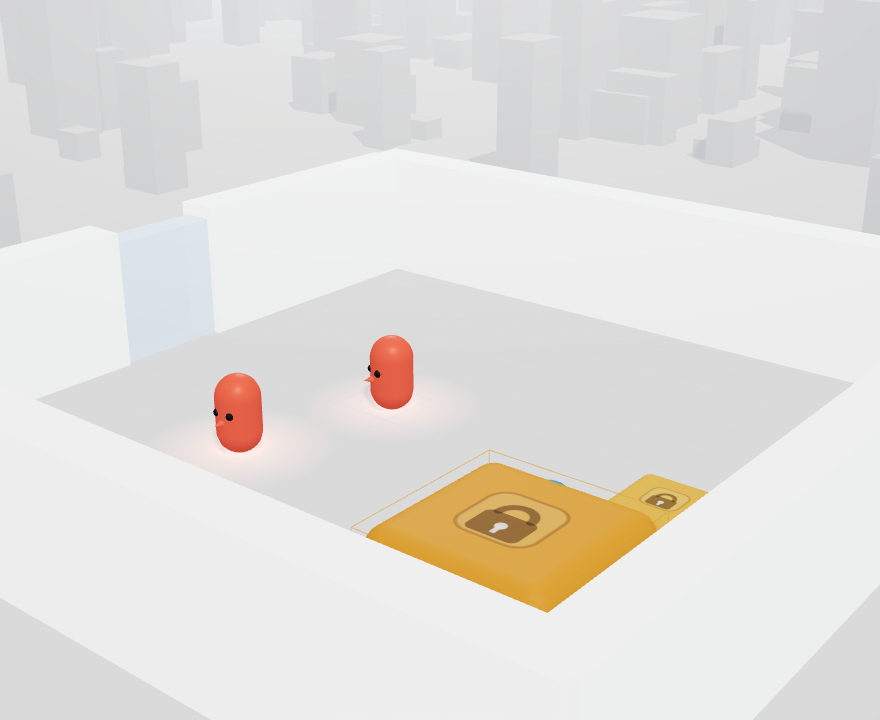

# Hide & Seek 2.0

[](https://github.com/GeFAA/hide-and-seek-2/actions/workflows/ci.yml)
[](https://github.com/GeFAA/hide-and-seek-2/releases)
[](LICENSE)
[](https://gefaa.github.io/hide-and-seek-2/)

> A modern **JAX / Flax** recreation **and expansion** of OpenAI's 2019
> *Emergent Tool Use From Multi-Agent Autocurricula* ("Hide-and-Seek").
>
> **▶ Try the live 3D demo in your browser (no install):**
> <https://gefaa.github.io/hide-and-seek-2/>



Hide & Seek 2.0 reimplements the classic hide-and-seek multi-agent
reinforcement-learning environment end-to-end on the GPU using
[JAX](https://github.com/google/jax) — environment physics, observation
generation, and learning all live inside a single `jax.jit`/`jax.lax.scan`
graph with **zero host↔device copies** in the training loop (the PureJaxRL /
JaxMARL philosophy). On top of a faithful recreation it adds a layer of new
mechanics — variable mass & cooperative physics, sensory decoys, fog of war,
destructible walls & doors, and stamina — designed to provoke richer emergent
tool use, deception, and teamwork. This repository is a **research scaffold**:
it is engineered to be correct, importable, and faithful to current JAX idioms,
and to *train fast* on a single accelerator. Performance figures quoted below
are **design targets, not measured benchmarks**.

---

## What's new in 2.0

- **Variable mass & cooperative physics.** Boxes come in light and heavy
  variants; a heavy box only moves when *several* agents push it together with
  enough combined force — forcing genuine cooperation rather than solo carrying.
- **Decoys & sensory manipulation.** A new decoy entity emits spoofed noise and
  mimics another entity's signature in the *local* (decentralized) observation,
  so opponents cannot tell a decoy from the real thing. Deception becomes a
  first-class strategy.
- **Fog of war & dynamic lighting.** GPU ray-casting computes line-of-sight,
  lidar, and a vision cone; fog patches attenuate sensing range for rays that
  pass through them, creating partial observability the agents must reason
  around.
- **Destructible walls & doors.** Fragile walls break under high-speed ramming
  and doors open after sustained contact, turning the arena layout itself into
  something agents can reshape into chokepoints or escape routes.
- **Stamina.** Sprinting and moving heavy objects drain a per-agent stamina
  budget that regenerates while idle, adding a resource-management dimension to
  chases and constructions.

---

## Watch it — 3D viewer

**Try it live in your browser (no install): <https://gefaa.github.io/hide-and-seek-2/>**

Hide & Seek 2.0 ships with a **clean, browser-based 3D replay viewer**
(Three.js, in the bright OpenAI *Emergent Tool Use* visual style) that plays back
an episode as an interactive god-view scene — agents,
boxes, ramps, walls, doors and decoys moving through the arena, with toggles for
vision cones, fog of war, decoy reveal, trails and a follow-cam. It is fully
decoupled from training: it reads only a self-contained **trajectory JSON file**
(the contract in [`viz/schema.py`](viz/schema.py)), so you can record on a GPU
and watch on a laptop. **No build step, nothing to `npm install`.**

You don't need JAX, a GPU, or a trained policy for a first look — a pure-stdlib
script writes a synthetic demo episode. From the repository root:

```bash
# 1. Generate the demo trajectory (pure stdlib — no jax/numpy needed)
python viz/make_demo_trajectory.py        # writes viz/web/trajectories/demo_trajectory.json

# 2. Serve viz/web on http://localhost:8000 (stdlib server, no deps)
python -m viz.serve

# 3. Open http://localhost:8000 in a browser
#    (must be http://, NOT file:// — the page uses ES modules)
```

Or via the Makefile: `make demo` then `make viz`. To record a **real** rollout
after a JAX run, use `viz/recorder.py`. Full guide, controls and the palette
legend: **[`viz/README.md`](viz/README.md)**.

### Scenarios

The viewer ships with several **named scenarios**, each a short curated episode
that isolates one emergent behaviour. Switch between them with the **in-viewer
scenario picker** (or load any trajectory file manually):

| Scenario | What it shows |
| --- | --- |
| **Synthetic Showcase** | The default demo episode — a tidy tour of all 2.0 mechanics at once. |
| **Fort Building** | Hiders fetch and stack boxes into a barricade during the prep phase. |
| **Ramp Use** | A seeker uses a ramp to climb and break the hiders' line of defence. |
| **Running & Chasing** | The open-field pursuit: seekers released, hiders fleeing across the arena. |
| **Door Blocking** | Hiders hold a chokepoint by blocking a doorway. |
| **Sensory Deception** | A decoy spoofs another entity's signature to mislead the seekers. |

The live demo opens on the **Synthetic Showcase**; pick another scenario from
the in-viewer picker to compare behaviours.

---

## Architecture overview

- **Entity-centric Transformer + GRU memory.** Each agent sees the world as a
  padded set of *entity feature vectors* (tokens). A permutation-invariant,
  masked self-attention Transformer encodes them; a PureJaxRL-style scanned GRU
  adds recurrent memory so agents retain **object permanence** through fog and
  occlusion.
- **MAPPO with CTDE.** Training uses Multi-Agent PPO under
  **Centralized-Training / Decentralized-Execution**: actors consume only their
  own *local, masked* observations, while the critic is given *privileged
  global* state (including which entities are truly decoys and which agents are
  grounded). Policies are parameter-shared per team.
- **ELO historical self-play.** Opponents are sampled from a pool of frozen
  historical snapshots weighted by ELO rating, mixed with current-policy
  self-play, to build a stable autocurriculum.
- **End-to-end on GPU, zero-copy JAX.** `reset`/`step` are pure functions; the
  trainer `vmap`s them over thousands of parallel environments and rolls them
  out inside `lax.scan`. There are no Python loops over environments and no host
  transfers in the hot path.

See [`docs/ARCHITECTURE.md`](docs/ARCHITECTURE.md) for a deeper dive and
[`docs/FEATURES_2.0.md`](docs/FEATURES_2.0.md) for a per-feature breakdown.

---

## Directory tree

```
hide-and-seek-2/
├── .github/
│   └── workflows/
│       ├── ci.yml             # CI: byte-compile + JAX-free config tests
│       └── pages.yml          # deploy viz/web to GitHub Pages
├── config.py                 # single source of truth for ALL dims & hyperparams
├── train.py                  # CLI entrypoint: build config -> make_train -> run
├── README.md
├── CHANGELOG.md               # Keep a Changelog, newest first
├── CONTRIBUTING.md            # dev setup, tests, viewer, adding scenarios
├── requirements.txt
├── pyproject.toml
├── Makefile
├── LICENSE                    # MIT
├── CITATION.cff
├── docs/
│   ├── CONTRACT.md            # authoritative struct / obs / action / module spec
│   ├── ARCHITECTURE.md        # data flow, CTDE, scan loop, 2.0 mechanic mapping
│   └── FEATURES_2.0.md        # one section per 2.0 feature
├── examples/
│   ├── __init__.py            # package marker (examples are run with PYTHONPATH=.)
│   └── quickstart.py          # minimal random/policy rollout demo
├── envs/
│   ├── __init__.py            # exports HideAndSeekEnv, State, GameState
│   ├── state.py               # PhysicsState, GameState, State (flax.struct)
│   ├── physics.py             # vectorized 2.5D physics + coop force + ground-contact
│   ├── procedural.py          # per-episode randomization (maps/teams/props/fog)
│   └── hide_and_seek.py       # HideAndSeekEnv: reset/step/reward/observe + 2.0 mechanics
├── models/
│   ├── __init__.py            # exports EntityTransformer, ActorRNN, CriticRNN, ScannedGRU
│   ├── transformer.py         # permutation-invariant entity encoder
│   ├── memory.py              # ScannedGRU: RNN with episode resets
│   ├── actor.py               # ActorRNN: encoder -> GRU -> hybrid heads
│   ├── critic.py              # CriticRNN: privileged encoder -> GRU -> scalar value
│   └── networks.py            # init helpers, param-count utils, carry factories
├── trainers/
│   ├── __init__.py            # exports make_train, EloManager, OpponentPool
│   ├── rollout.py             # Transition pytree + batchify/step glue
│   ├── selfplay.py            # OpponentPool + ELO-based opponent sampling
│   └── mappo.py               # make_train(config) -> jitted train fn
├── utils/
│   ├── __init__.py
│   ├── visibility.py          # GPU ray-casting: LOS, lidar, vision cone, fog
│   ├── elo.py                 # expected_score, update_elo
│   ├── spaces.py              # Box/Discrete/Dict space descriptors
│   ├── pytree.py              # batchify/unbatchify multi-agent dicts
│   └── logging.py             # metric aggregation, optional wandb/tensorboard
├── viz/                       # 3D replay viewer (decoupled from training)
│   ├── README.md              # viewer guide: quick look, recording, controls
│   ├── schema.py              # trajectory file contract (stdlib only)
│   ├── make_demo_trajectory.py# synthetic demo episode generator (stdlib only)
│   ├── recorder.py            # export REAL JAX rollouts to the format (numpy)
│   ├── serve.py               # `python -m viz.serve` -> serves viz/web
│   └── web/                   # Three.js viewer, clean/light (no build step)
│       ├── trajectories/      # committed scenario JSONs + manifest.json
│       │   ├── manifest.json  # scenario list for the in-viewer picker
│       │   ├── demo_trajectory.json
│       │   └── *.json         # named scenarios (fort, ramp, chase, door, decoy)
│       └── recordings/        # local-only real rollouts (gitignored)
└── tests/                     # pytest sanity tests (shapes, jit, vmap, elo)
```

> Note: the `envs/`, `models/`, `trainers/`, and `utils/` packages are built by
> the rest of the project; this layout mirrors the authoritative
> [`docs/CONTRACT.md`](docs/CONTRACT.md).

---

## Install

Hide & Seek 2.0 targets **Python ≥ 3.10**.

```bash
# 1. (recommended) create and activate a virtual environment
python -m venv .venv && source .venv/bin/activate   # Windows: .venv\Scripts\activate

# 2. install the Python dependencies
pip install -r requirements.txt
# or, as a package (editable):
pip install -e .
```

### GPU / CUDA note

`requirements.txt` pulls in the **CPU** build of `jaxlib`, which is enough to
import everything and run the CPU smoke tests. To actually train at speed you
must install a **CUDA-enabled `jaxlib`** that matches your CUDA / cuDNN /
driver versions. Always follow the official JAX install matrix:
<https://jax.readthedocs.io/en/latest/installation.html>. For example (verify
the current command for your platform first):

```bash
pip install -U "jax[cuda12]"
```

CPU-only execution works for development and the `make smoke` demo; full-scale
training (`num_envs = 2048`) is intended for a GPU.

---

## Quickstart

From the repository root (so absolute imports like `from config import Config`
resolve):

```bash
# minimal demo: build a debug config, run a short vmapped rollout, print shapes
PYTHONPATH=. python examples/quickstart.py

# launch training (uses config.default_config() by default)
PYTHONPATH=. python train.py
```

On Windows PowerShell:

```powershell
$env:PYTHONPATH = "."
python examples\quickstart.py
python train.py
```

The `quickstart.py` script imports cleanly even **without JAX installed**: it
prints an instructive message and exits rather than crashing, so you can sanity
check the layout before setting up an accelerator.

---

## The entity / observation / action contract (summary)

The full, authoritative specification lives in
[`docs/CONTRACT.md`](docs/CONTRACT.md). In brief:

- **Entities.** Everything in the world — agents and props — is one of 8 entity
  types (`hider`, `seeker`, `box_light`, `box_heavy`, `ramp`, `decoy`, `wall`,
  `door`), encoded as fixed-order one-hots. The order is part of the public
  contract.
- **Observations** (`State.obs`, a dict keyed by agent index):
  - `entities` `(A, E, Fe)` — per-agent **local** entity tokens in relative
    coords, zeroed where not visible; `Fe = 12 + N_ENTITY_TYPES = 20`.
  - `entity_mask` `(A, E)` — visibility mask (active **and** in
    LOS / lidar / vision / fog).
  - `self` `(A, Fs)` — proprioception of the observing agent; `Fs = 14`.
  - `global_entities` `(E, Fg)` — **privileged** absolute tokens for the critic,
    with two extra features (`true_is_decoy`, `grounded`); `Fg = Fe + 2 = 22`.
  - `global_mask` `(E,)` — existence-only mask for the critic.
  - `agent_active` `(A,)` — which agent slots are real this episode.
- **Actions** (`action`, a dict keyed by agent index):
  - `move` `(A, 3)` — continuous `[fx, fy, torque]` in `[-1, 1]`.
  - `interact` `(A, 3)` — discrete categoricals `[grab, lock, decoy]`.

All shared dimensions are **derived once** in [`config.py`](config.py) and read
everywhere else — never hard-coded downstream.

---

## Fixes & improvements vs the 2019 original

- **Strict Newtonian ground-contact (anti "box-surfing").** In the original
  work agents discovered they could exploit the physics to ride ("surf") boxes
  in ways the designers did not intend. Hide & Seek 2.0 gates all locomotion
  force on a strict `grounded` flag: an agent that has climbed onto a box, ramp,
  or wall (elevation `z > 0`) cannot apply self-propulsion until it touches the
  ground again. Look for the
  `# FIX: strict Newtonian ground-contact (no box-surfing)` tag in
  `envs/physics.py`.
- **GPU simulation ⇒ hours, not weeks.** The original autocurriculum took on the
  order of hundreds of millions of episodes across large CPU clusters. By
  running the environment *and* the learner on-device and vectorizing across
  thousands of parallel environments with `vmap` + `scan`, the same scale of
  experience is intended to be reachable on a single modern GPU in a far shorter
  wall-clock time. (This is a design target of the architecture, not a measured
  benchmark in this scaffold.)

---

## Citation

If you use this project, please cite it (see [`CITATION.cff`](CITATION.cff)) and
the original OpenAI work that inspired it:

```bibtex
@misc{hideandseek2_2026,
  title        = {Hide \& Seek 2.0: A JAX Recreation and Expansion of
                  Emergent Tool Use},
  author       = {Hide \& Seek 2.0 contributors},
  year         = {2026},
  howpublished = {\url{https://github.com/GeFAA/hide-and-seek-2}},
  note         = {Research scaffold}
}

@article{baker2019emergent,
  title   = {Emergent Tool Use From Multi-Agent Autocurricula},
  author  = {Baker, Bowen and Kanitscheider, Ingmar and Markov, Todor and Wu,
             Yi and Powell, Glenn and McGrew, Bob and Mordatch, Igor},
  journal = {arXiv preprint arXiv:1909.07528},
  year    = {2019}
}
```

---

## Contributing

Contributions are welcome — see [`CONTRIBUTING.md`](CONTRIBUTING.md) for dev
setup, running the tests and viewer, code style, and how to add a new viewer
scenario.

Changelog: see [`CHANGELOG.md`](CHANGELOG.md) for the per-release notes.

---

## License

Released under the [MIT License](LICENSE), © 2026.

---

## Acknowledgements

Hide & Seek 2.0 is an independent, open-source reimagining inspired by OpenAI's
2019 *Emergent Tool Use From Multi-Agent Autocurricula* ("Hide-and-Seek").
Full credit for the original environment, experiments, and the insight that
multi-agent autocurricula drive emergent tool use belongs to the OpenAI authors.
This project is not affiliated with or endorsed by OpenAI. We also gratefully
acknowledge the [JAX](https://github.com/google/jax),
[Flax](https://github.com/google/flax),
[Optax](https://github.com/google-deepmind/optax),
[distrax](https://github.com/google-deepmind/distrax),
[PureJaxRL](https://github.com/luchris429/purejaxrl), and
[JaxMARL](https://github.com/FLAIROx/JaxMARL) communities, whose idioms this
scaffold follows.
